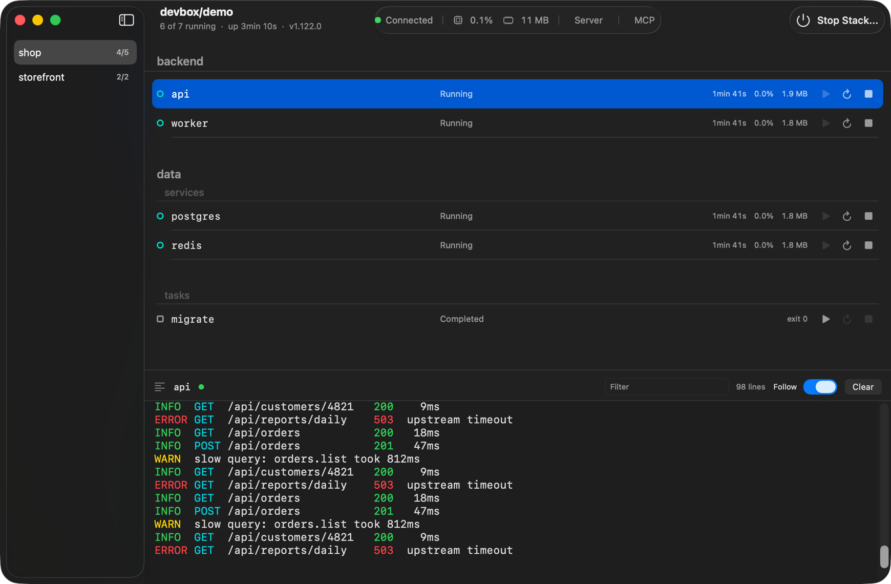

# process-compose-macos

A macOS window onto a [process-compose](https://github.com/F1bonacc1/process-compose) dev stack.
A sidebar picks one project at a time; the list groups that project's processes by namespace,
streams their logs, and starts or stops them one at a time or all at once.



Unofficial project. Not affiliated with or endorsed by process-compose.

## Requirements

- macOS 14 or later
- process-compose, either already running with its REST API reachable or installed for the app to start

## Install

```
brew install thalesfp/process-compose-macos/process-compose-macos
```

## Build

```
make build     # debug build
make test      # ProcessComposeCore test suite
make run       # run without bundling
make app       # assemble the .app into build/
make install   # build and copy the app to /Applications
```

There is no Xcode project. Swift Package Manager builds the binary and `Scripts/bundle.sh`
assembles the `.app` around it.

## Connecting

The app talks to `localhost:28080`. `PC_PORT_NUM` sets the port on first launch, and
Settings (Cmd+,) sets it from then on.

## Starting the server

Set Up Server, in the window and in the Server menu, asks for a `process-compose` binary, a
project config and a working directory, checks the config, and saves. With those set, Start
Stack starts the server when nothing answers the port. The app never starts one on its own. It runs
`process-compose up -f <config> -p <port> -t=false --keep-project`, shows the server's
output in the log pane, and stops the server when the app quits. A pid file under
Application Support lets the next launch take back a server left behind by a crash.

Working directory is where process-compose runs. A config's `working_dir` and `watch`
paths are relative to it, so a config that lives in a subdirectory of the workspace needs
the workspace here. Empty means the config's own directory. The binary can be a script that
runs process-compose, which is how a stack that needs a pinned toolchain gets one.

The setup sheet validates a config with `process-compose up --dry-run`, and the app runs the
same check before it starts a server, so a config that will not load says why instead of leaving
a server that exits.

A server that is already answering the port is left alone: the app attaches to it and never
stops it. It takes the config path from that server as a suggestion and fills the setup
sheet in with it, so a stack started from a terminal is a Save away from being startable
here. Nothing is ever run from that suggestion until it is checked and saved, since anything
at all can answer a port.

## Stopping and starting the stack

The power button stops every running process but leaves the server up, so it can start them
again. process-compose exits once its last process stops, so a stack you launch yourself
needs `--keep-project` or the server will not be there to start anything.

## License

MIT. See [LICENSE](LICENSE).
